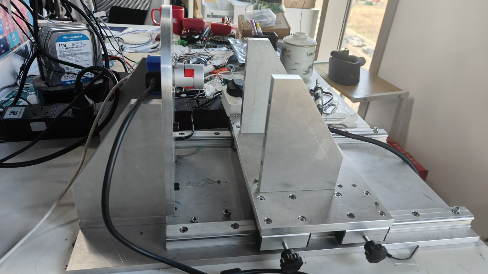

# 多摩川编码器测试工装

硬件部分：https://oshwhub.com/godsheep/encoder_evk

# 已知问题

1.电源部分需要优化

2.机械部分有打滑风险

3.机械部分考虑怎样提升同轴度

#Todo

  测速方法
  
  速度测量间隔500us
  
  速度低通滤波，500hz
  
  计算5s内的最大速度max，最小速度min，平均速度average，
  
  速度波动 = （max-min）/average/2
